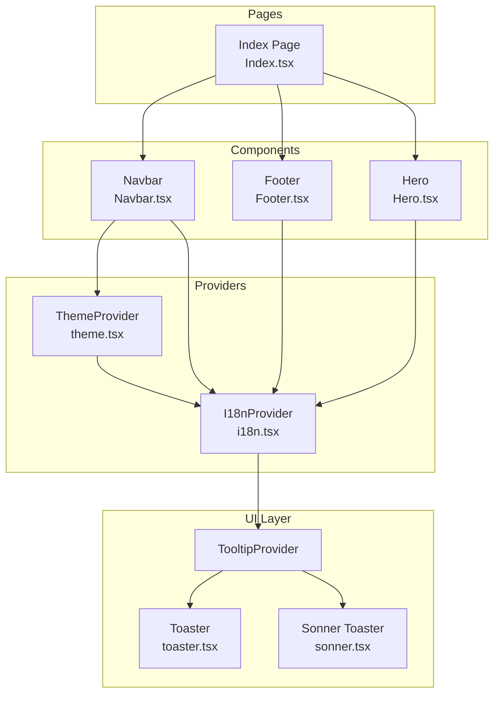
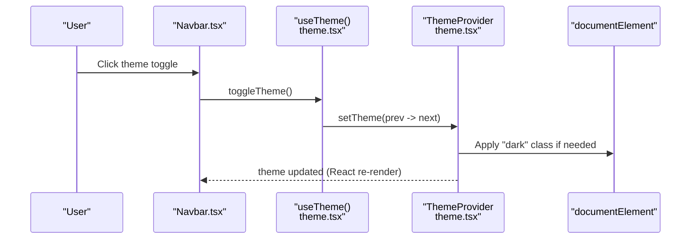
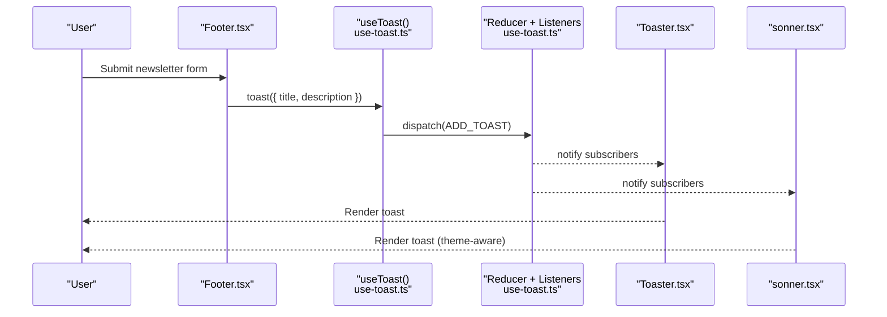
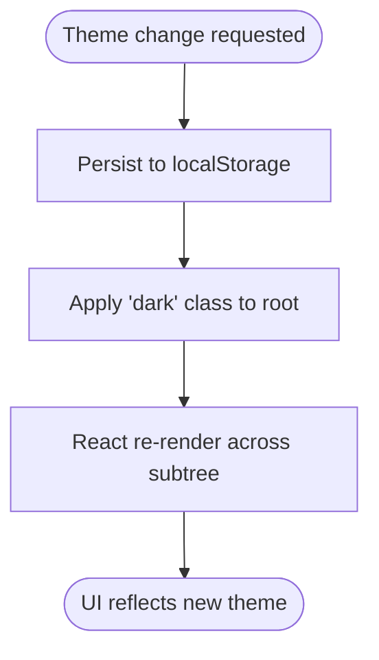
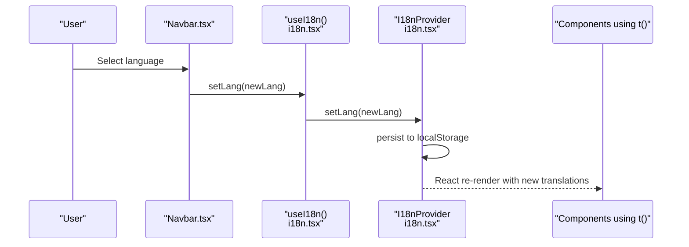
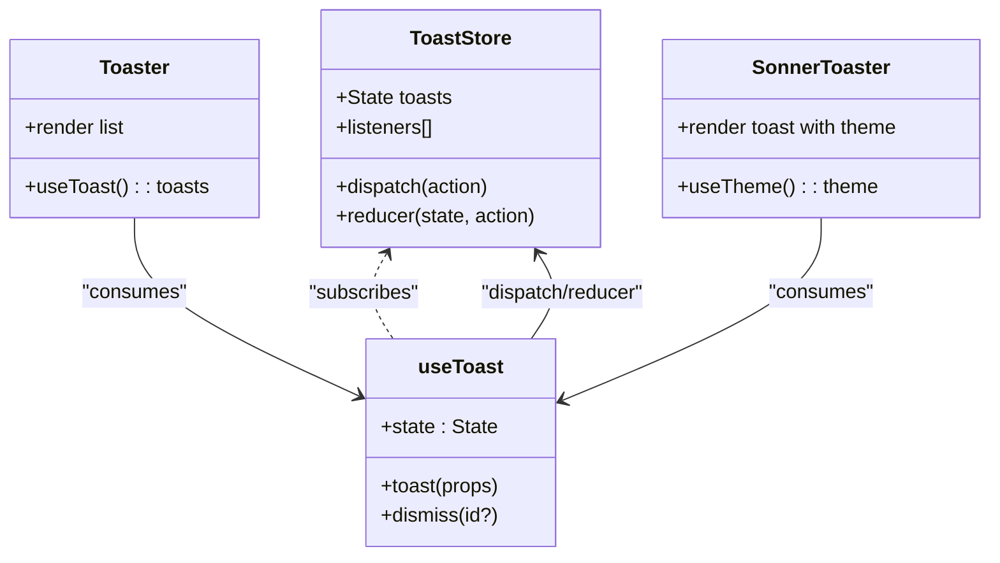
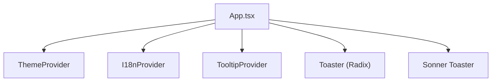

# State Synchronization

<cite>
**Referenced Files in This Document**
- [theme.tsx](file://src/lib/theme.tsx)
- [i18n.tsx](file://src/lib/i18n.tsx)
- [use-toast.ts](file://src/hooks/use-toast.ts)
- [toaster.tsx](file://src/components/ui/toaster.tsx)
- [sonner.tsx](file://src/components/ui/sonner.tsx)
- [toast.tsx](file://src/components/ui/toast.tsx)
- [App.tsx](file://src/App.tsx)
- [Navbar.tsx](file://src/components/Navbar.tsx)
- [Footer.tsx](file://src/components/Footer.tsx)
- [Hero.tsx](file://src/components/Hero.tsx)
- [Index.tsx](file://src/pages/Index.tsx)
- [package.json](file://package.json)
</cite>

## Table of Contents
1. [Introduction](#introduction)
2. [Project Structure](#project-structure)
3. [Core Components](#core-components)
4. [Architecture Overview](#architecture-overview)
5. [Detailed Component Analysis](#detailed-component-analysis)
6. [Dependency Analysis](#dependency-analysis)
7. [Performance Considerations](#performance-considerations)
8. [Troubleshooting Guide](#troubleshooting-guide)
9. [Conclusion](#conclusion)

## Introduction
This document explains how global state changes propagate through the application’s component tree, focusing on three primary areas:
- Theme switching synchronization across components
- Language changes across components
- Toast notification state management and rendering

It documents event-driven state updates, subscription patterns, and state derivation approaches. It also covers cross-component communication, state broadcasting, reactive updates, synchronization challenges, race conditions, consistency maintenance, coordination across contexts, and side effect management.

## Project Structure
The application organizes state at the provider level and exposes hooks for consumption:
- Theme state is provided via a React Context and consumed by components
- Internationalization state is provided via a React Context and consumed by components
- Toast state is centralized with a reducer and a listener pattern for broadcasting updates

Providers are wired at the root of the app so that child components can subscribe to and react to state changes.

**Diagram sources**
- [App.tsx](file://src/App.tsx#L19-L42)
- [theme.tsx](file://src/lib/theme.tsx#L12-L31)
- [i18n.tsx](file://src/lib/i18n.tsx#L148-L168)
- [toaster.tsx](file://src/components/ui/toaster.tsx#L4-L24)
- [sonner.tsx](file://src/components/ui/sonner.tsx#L6-L25)
- [Index.tsx](file://src/pages/Index.tsx#L12-L25)
- [Navbar.tsx](file://src/components/Navbar.tsx#L13-L131)
- [Hero.tsx](file://src/components/Hero.tsx#L6-L53)
- [Footer.tsx](file://src/components/Footer.tsx#L13-L103)

**Section sources**
- [App.tsx](file://src/App.tsx#L1-L45)

## Core Components
- Theme Provider and Hook
  - Provides current theme and a toggle function
  - Persists theme selection to local storage and applies a class to the root element
  - Consumed by Navbar and Footer to switch logos and other theme-dependent visuals

- Internationalization Provider and Hook
  - Provides current language, a setter, and a translation function
  - Persists language selection to local storage
  - Consumed by Navbar, Hero, Footer, and other components to render localized text

- Toast System
  - Centralized reducer manages toast lifecycle and limits
  - Broadcasts state changes to subscribers via a listener array
  - Exposes imperative toast and declarative Toaster components for rendering

**Section sources**
- [theme.tsx](file://src/lib/theme.tsx#L1-L36)
- [i18n.tsx](file://src/lib/i18n.tsx#L1-L173)
- [use-toast.ts](file://src/hooks/use-toast.ts#L1-L187)
- [toaster.tsx](file://src/components/ui/toaster.tsx#L1-L25)
- [sonner.tsx](file://src/components/ui/sonner.tsx#L1-L28)

## Architecture Overview
The state synchronization architecture relies on:
- React Context providers for theme and i18n
- A reducer-based toast store with a publish-subscribe mechanism
- Root-level providers ensuring all components can subscribe
- Imperative toast API for side-effect-heavy actions (e.g., form submissions)

**Diagram sources**
- [Navbar.tsx](file://src/components/Navbar.tsx#L63-L70)
- [theme.tsx](file://src/lib/theme.tsx#L19-L22)
- [theme.tsx](file://src/lib/theme.tsx#L24-L24)

**Diagram sources**
- [Footer.tsx](file://src/components/Footer.tsx#L18-L23)
- [use-toast.ts](file://src/hooks/use-toast.ts#L137-L164)
- [use-toast.ts](file://src/hooks/use-toast.ts#L128-L133)
- [toaster.tsx](file://src/components/ui/toaster.tsx#L4-L24)
- [sonner.tsx](file://src/components/ui/sonner.tsx#L6-L25)

## Detailed Component Analysis

### Theme Synchronization
- Provider initialization reads persisted theme or prefers-color-scheme
- Effects apply a class to the root element and persist the theme
- Consumers derive dependent UI (e.g., logo choice) from theme state
- Toggle switches between light and dark

**Diagram sources**
- [theme.tsx](file://src/lib/theme.tsx#L13-L22)
- [Navbar.tsx](file://src/components/Navbar.tsx#L24-L28)

**Section sources**
- [theme.tsx](file://src/lib/theme.tsx#L1-L36)
- [Navbar.tsx](file://src/components/Navbar.tsx#L1-L131)

### Language Changes Across Components
- Provider initializes language from localStorage or defaults
- Translation function resolves keys per current language
- Consumers render localized text; language switchers update state and persistence

**Diagram sources**
- [Navbar.tsx](file://src/components/Navbar.tsx#L48-L61)
- [i18n.tsx](file://src/lib/i18n.tsx#L148-L168)
- [i18n.tsx](file://src/lib/i18n.tsx#L154-L161)

**Section sources**
- [i18n.tsx](file://src/lib/i18n.tsx#L1-L173)
- [Navbar.tsx](file://src/components/Navbar.tsx#L1-L131)
- [Hero.tsx](file://src/components/Hero.tsx#L1-L53)
- [Footer.tsx](file://src/components/Footer.tsx#L1-L103)

### Toast Notification State Management
- Central reducer maintains a capped list of toasts
- Dispatch broadcasts state to listeners
- Two renderer components consume the same store:
  - Radix-based Toaster
  - Sonner Toaster (with theme awareness via next-themes)

**Diagram sources**
- [use-toast.ts](file://src/hooks/use-toast.ts#L49-L122)
- [use-toast.ts](file://src/hooks/use-toast.ts#L124-L133)
- [use-toast.ts](file://src/hooks/use-toast.ts#L166-L184)
- [toaster.tsx](file://src/components/ui/toaster.tsx#L4-L24)
- [sonner.tsx](file://src/components/ui/sonner.tsx#L6-L25)

**Section sources**
- [use-toast.ts](file://src/hooks/use-toast.ts#L1-L187)
- [toaster.tsx](file://src/components/ui/toaster.tsx#L1-L25)
- [sonner.tsx](file://src/components/ui/sonner.tsx#L1-L28)
- [toast.tsx](file://src/components/ui/toast.tsx#L1-L87)

### Cross-Component Communication Patterns
- Event-driven updates: clicking a language switch triggers a state update; components re-render automatically
- Subscription pattern: components subscribe to providers via hooks; state changes trigger re-renders
- State derivation: components derive UI decisions from state (e.g., logo based on theme)
- Broadcasting: toast store notifies all subscribers upon state changes

Examples:
- Navbar toggles theme and renders icons based on theme
- Footer subscribes to i18n to localize messages and triggers toast after submission
- Hero and other components render localized strings via the translation function

**Section sources**
- [Navbar.tsx](file://src/components/Navbar.tsx#L1-L131)
- [Footer.tsx](file://src/components/Footer.tsx#L1-L103)
- [Hero.tsx](file://src/components/Hero.tsx#L1-L53)
- [i18n.tsx](file://src/lib/i18n.tsx#L1-L173)

### Reactive Updates and Side Effects
- Theme provider applies a class to the root element and persists theme
- Toast imperative API creates, updates, and dismisses toasts; dismiss triggers removal after delay
- Sonner integrates with next-themes to align toast appearance with theme

Patterns:
- Pure state updates with minimal side effects
- Controlled side effects in effects (e.g., DOM class toggling)
- Centralized side effects in reducers (e.g., scheduling removal)

**Section sources**
- [theme.tsx](file://src/lib/theme.tsx#L19-L22)
- [use-toast.ts](file://src/hooks/use-toast.ts#L55-L69)
- [use-toast.ts](file://src/hooks/use-toast.ts#L85-L121)
- [sonner.tsx](file://src/components/ui/sonner.tsx#L6-L25)

## Dependency Analysis
Providers are wired at the root, ensuring deep subscriptions:
- Theme and i18n providers wrap TooltipProvider, Toaster, and Sonner
- Pages and components beneath them receive state via hooks

External integrations:
- Sonner integrates with next-themes for theme-awareness
- Radix UI toast primitives underpin the default Toaster

**Diagram sources**
- [App.tsx](file://src/App.tsx#L19-L42)

**Section sources**
- [App.tsx](file://src/App.tsx#L1-L45)
- [package.json](file://package.json#L52-L64)

## Performance Considerations
- Context granularity: Keep providers near the root to avoid unnecessary re-renders while maintaining accessibility
- Memoization: Translation and language setters are memoized to prevent redundant renders
- Toast limits: A cap on concurrent toasts reduces rendering overhead
- Efficient broadcasting: Listener array updates are O(n) per dispatch; consider batching if many consumers exist

## Troubleshooting Guide
Common issues and resolutions:
- Theme not applying immediately
  - Ensure the root element receives the “dark” class and localStorage persists the value
  - Verify the effect runs on theme changes

- Language not changing across components
  - Confirm the i18n provider wraps all components and that the setter updates state and localStorage

- Toast not appearing
  - Ensure the app mounts either Toaster or Sonner
  - Verify the toast imperative call is executed and the reducer dispatches

- Duplicate or stale toasts
  - Check the toast limit and dismissal timeouts
  - Ensure listeners are properly registered/unregistered in hooks

**Section sources**
- [theme.tsx](file://src/lib/theme.tsx#L19-L22)
- [i18n.tsx](file://src/lib/i18n.tsx#L148-L168)
- [toaster.tsx](file://src/components/ui/toaster.tsx#L4-L24)
- [use-toast.ts](file://src/hooks/use-toast.ts#L5-L7)
- [use-toast.ts](file://src/hooks/use-toast.ts#L124-L133)

## Conclusion
The application achieves robust state synchronization through:
- Provider-based global state for theme and language
- A reducer-backed toast store with a listener pattern for broadcasting
- Clear separation of concerns: pure state updates, controlled side effects, and declarative rendering

These patterns enable consistent, reactive updates across the component tree, support cross-component communication, and maintain synchronization despite asynchronous events and side effects.