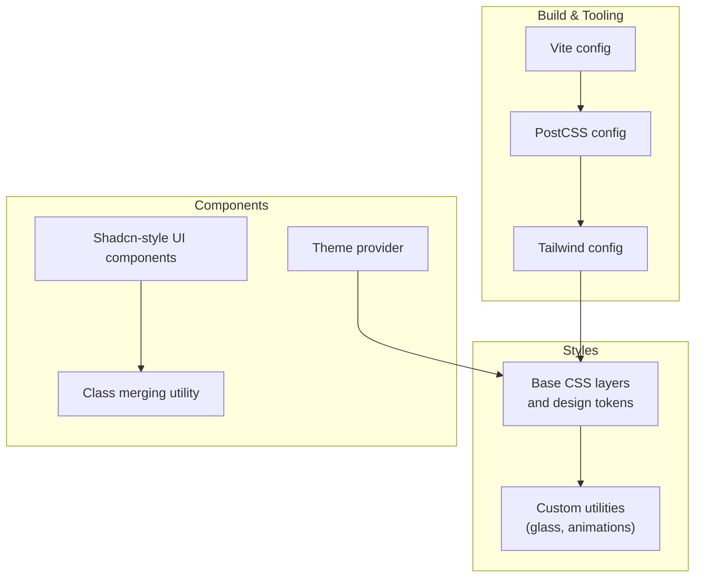
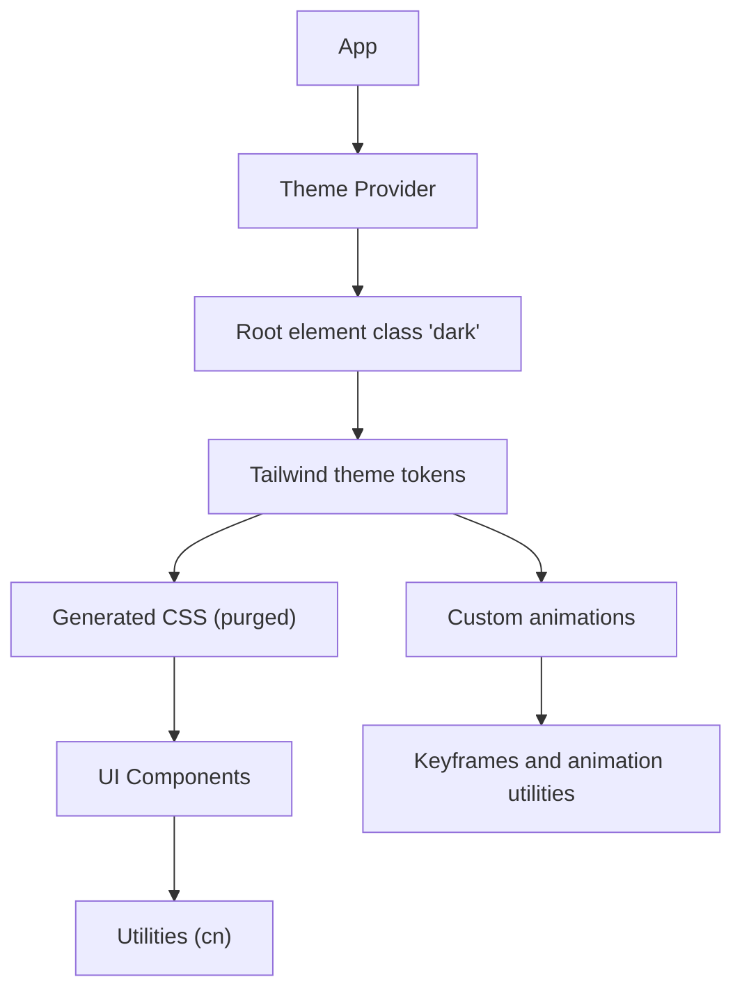
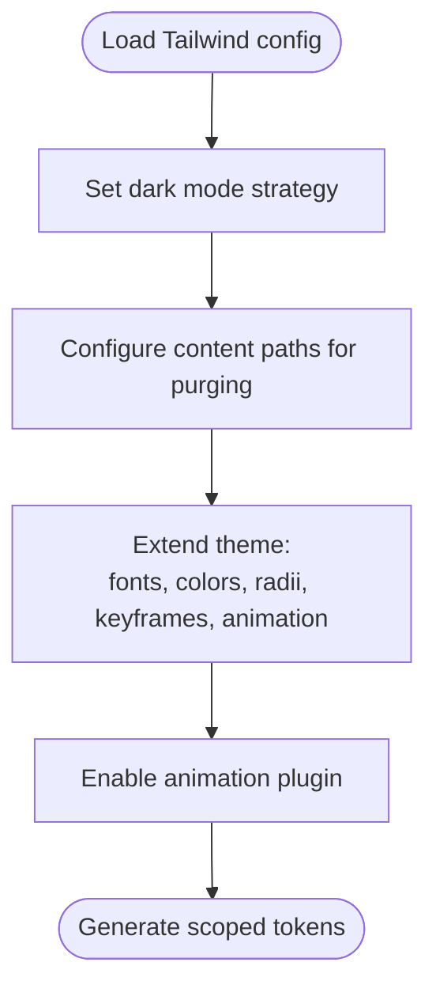
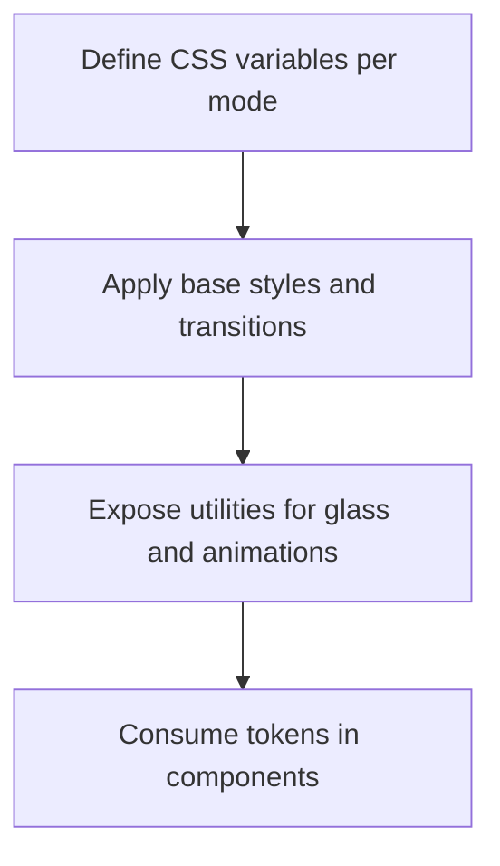
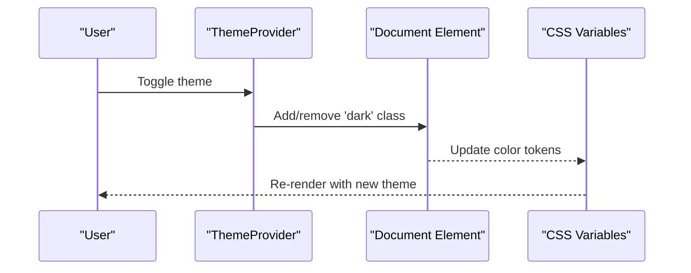
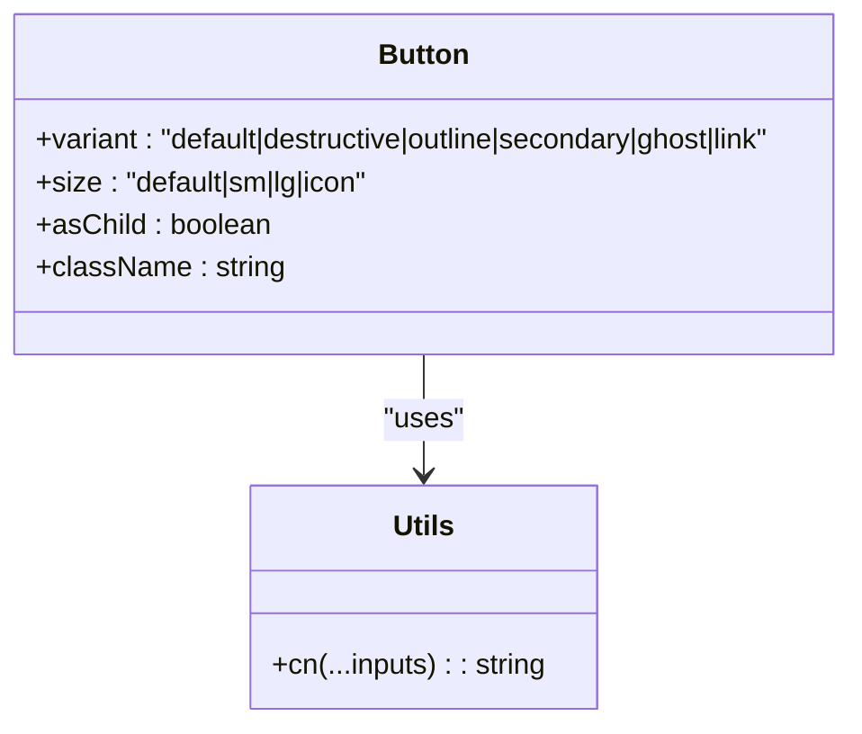
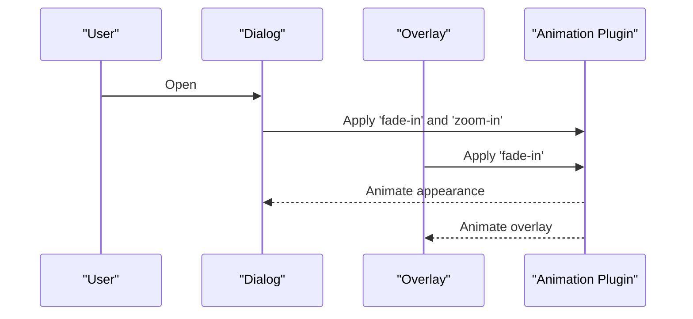
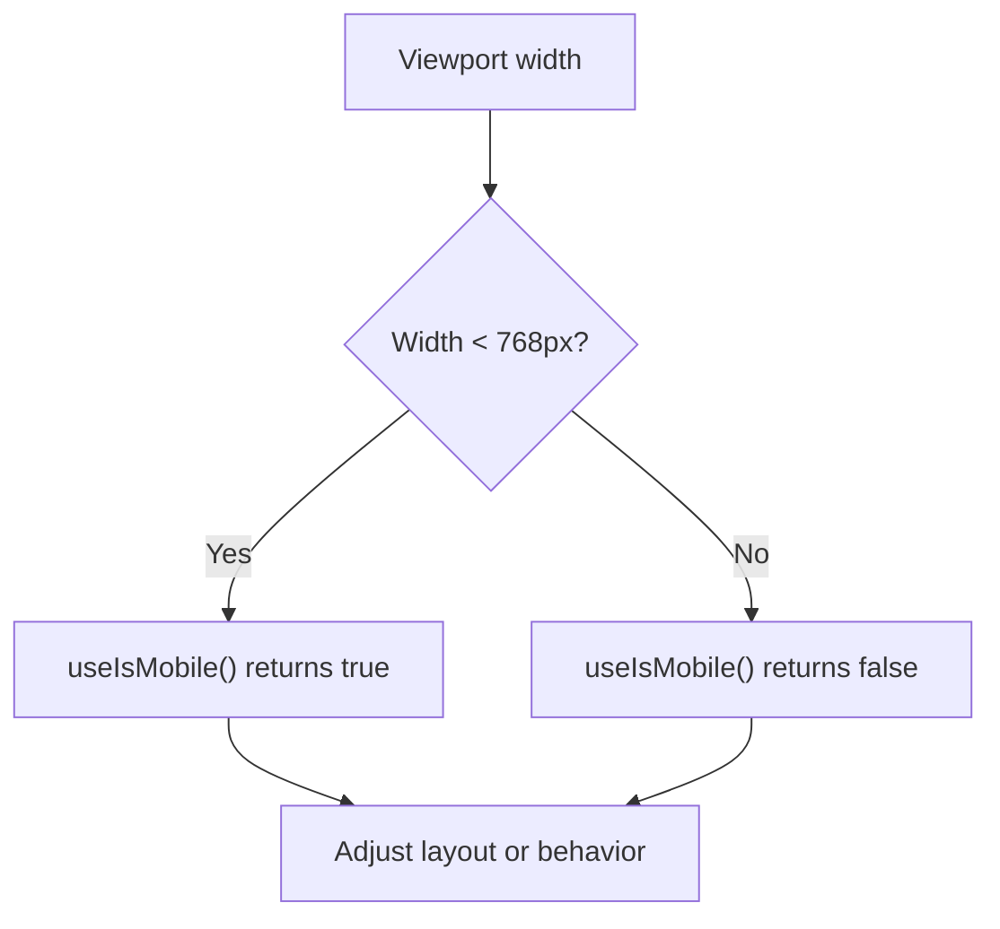
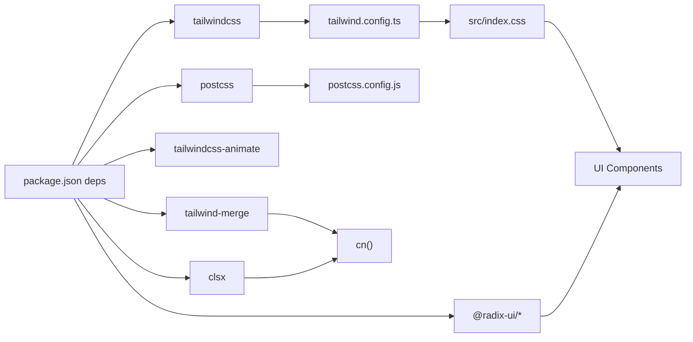

# Styling and Design System

<cite>
**Referenced Files in This Document**
- [tailwind.config.ts](file://tailwind.config.ts)
- [postcss.config.js](file://postcss.config.js)
- [components.json](file://components.json)
- [src/index.css](file://src/index.css)
- [src/App.css](file://src/App.css)
- [src/lib/utils.ts](file://src/lib/utils.ts)
- [src/lib/theme.tsx](file://src/lib/theme.tsx)
- [src/hooks/use-mobile.tsx](file://src/hooks/use-mobile.tsx)
- [src/components/ui/button.tsx](file://src/components/ui/button.tsx)
- [src/components/ui/card.tsx](file://src/components/ui/card.tsx)
- [src/components/ui/input.tsx](file://src/components/ui/input.tsx)
- [src/components/ui/dialog.tsx](file://src/components/ui/dialog.tsx)
- [src/components/ui/tabs.tsx](file://src/components/ui/tabs.tsx)
- [package.json](file://package.json)
- [vite.config.ts](file://vite.config.ts)
</cite>

## Table of Contents
1. [Introduction](#introduction)
2. [Project Structure](#project-structure)
3. [Core Components](#core-components)
4. [Architecture Overview](#architecture-overview)
5. [Detailed Component Analysis](#detailed-component-analysis)
6. [Dependency Analysis](#dependency-analysis)
7. [Performance Considerations](#performance-considerations)
8. [Troubleshooting Guide](#troubleshooting-guide)
9. [Conclusion](#conclusion)
10. [Appendices](#appendices)

## Introduction
This document describes the styling architecture and design system used in the project. It covers Tailwind CSS configuration, the custom color palette, typography system, responsive design patterns, and the utility-first approach. It also explains component styling strategies, design token management via CSS variables, animation and transition effects, spacing conventions, breakpoint management, and performance optimization through purging and CSS optimization. Finally, it provides guidelines for extending the design system while maintaining consistency.

## Project Structure
The styling system is organized around:
- Tailwind configuration that defines design tokens, custom animations, and plugin integrations
- PostCSS pipeline enabling Tailwind and Autoprefixer
- A centralized CSS layering strategy using Tailwind layers and custom utilities
- A component library built with shadcn/ui conventions and Radix UI primitives
- A theme provider for light/dark mode switching with persistent storage
- Utility helpers for merging class names and composing component variants

**Diagram sources**
- [vite.config.ts](file://vite.config.ts#L1-L22)
- [postcss.config.js](file://postcss.config.js#L1-L7)
- [tailwind.config.ts](file://tailwind.config.ts#L1-L86)
- [src/index.css](file://src/index.css#L1-L146)
- [src/lib/utils.ts](file://src/lib/utils.ts#L1-L7)
- [src/lib/theme.tsx](file://src/lib/theme.tsx#L1-L36)
- [src/components/ui/button.tsx](file://src/components/ui/button.tsx#L1-L48)

**Section sources**
- [tailwind.config.ts](file://tailwind.config.ts#L1-L86)
- [postcss.config.js](file://postcss.config.js#L1-L7)
- [components.json](file://components.json#L1-L21)
- [src/index.css](file://src/index.css#L1-L146)
- [vite.config.ts](file://vite.config.ts#L1-L22)

## Core Components
- Tailwind configuration: Defines dark mode strategy, content paths for purging, design tokens (colors, radii, fonts), custom animations, and plugin integrations.
- CSS base layers: Establishes CSS variables for design tokens, applies global styles, and defines custom utilities for glassmorphism and animations.
- Theme provider: Manages theme persistence and toggling with a class on the root element.
- Component library: Built with shadcn conventions using class variance authority (CVA) for variants and sizes, and a shared class merging utility.
- Responsive utilities: Uses Tailwind’s breakpoints and a mobile detection hook for runtime adjustments.

**Section sources**
- [tailwind.config.ts](file://tailwind.config.ts#L3-L85)
- [src/index.css](file://src/index.css#L5-L90)
- [src/lib/theme.tsx](file://src/lib/theme.tsx#L12-L31)
- [src/lib/utils.ts](file://src/lib/utils.ts#L4-L6)
- [src/hooks/use-mobile.tsx](file://src/hooks/use-mobile.tsx#L3-L19)

## Architecture Overview
The styling architecture follows a layered approach:
- Build pipeline: Vite compiles TypeScript/JSX; PostCSS runs Tailwind directives and Autoprefixer; Tailwind scans configured paths to generate only used CSS.
- Tokens and themes: CSS variables define semantic tokens; Tailwind reads HSL values and maps them to design tokens; dark mode toggles a root class.
- Components: UI components use CVA for variants/sizes and a shared cn utility to merge classes safely.
- Animations and transitions: Tailwind’s animate plugin and custom keyframes provide smooth motion.

**Diagram sources**
- [src/lib/theme.tsx](file://src/lib/theme.tsx#L19-L22)
- [tailwind.config.ts](file://tailwind.config.ts#L13-L82)
- [src/index.css](file://src/index.css#L131-L145)
- [src/components/ui/button.tsx](file://src/components/ui/button.tsx#L7-L31)

## Detailed Component Analysis

### Tailwind Configuration and Token Management
- Dark mode: Controlled via a class strategy for seamless theme switching.
- Content scanning: Purges unused CSS by scanning TS/TSX files under pages, components, app, and src.
- Design tokens:
  - Colors: Semantic roles mapped to CSS variables (background, foreground, primary, secondary, muted, accent, destructive, border, input, ring, popover, card, sidebar).
  - Typography: Font families for serif and sans-serif are registered and applied globally.
  - Border radius: Radius token driven by a CSS variable for consistent corner rounding.
  - Animations: Accordion animations are defined and exposed via Tailwind utilities.
- Plugins: Tailwind integrates with the animation plugin for motion utilities.

**Diagram sources**
- [tailwind.config.ts](file://tailwind.config.ts#L4-L84)

**Section sources**
- [tailwind.config.ts](file://tailwind.config.ts#L4-L84)

### CSS Variables and Base Layers
- Root tokens: CSS variables define semantic tokens for light and dark modes, including special glassmorphism variables.
- Global base styles: Apply border color, background, text color, and font families; include transitions for theme changes.
- Utilities:
  - Glassmorphism utilities: Provide subtle, strong, and balanced glass effects using backdrop filters and borders.
  - Animation utilities: Fade-in and fade-up animations backed by custom keyframes.

**Diagram sources**
- [src/index.css](file://src/index.css#L6-L76)
- [src/index.css](file://src/index.css#L78-L90)
- [src/index.css](file://src/index.css#L92-L129)
- [src/index.css](file://src/index.css#L131-L145)

**Section sources**
- [src/index.css](file://src/index.css#L6-L90)
- [src/index.css](file://src/index.css#L92-L145)

### Theme Provider and Dark Mode
- Persists user preference in local storage and respects OS preference.
- Toggles a class on the root element to switch Tailwind’s dark variant.
- Integrates with the CSS variable tokens to update colors and glassmorphism visuals.

**Diagram sources**
- [src/lib/theme.tsx](file://src/lib/theme.tsx#L19-L22)
- [src/index.css](file://src/index.css#L42-L75)

**Section sources**
- [src/lib/theme.tsx](file://src/lib/theme.tsx#L12-L31)

### Component Styling Strategies
- Variants and sizes: Components define variants (e.g., default, destructive, outline, secondary, ghost, link) and sizes (default, sm, lg, icon) using CVA.
- Class merging: A shared cn utility merges Tailwind classes safely, preventing conflicts and ensuring defaults apply.
- Composition: Components forward refs and props, allowing composition with icons and other elements.

**Diagram sources**
- [src/components/ui/button.tsx](file://src/components/ui/button.tsx#L7-L31)
- [src/lib/utils.ts](file://src/lib/utils.ts#L4-L6)

**Section sources**
- [src/components/ui/button.tsx](file://src/components/ui/button.tsx#L7-L48)
- [src/components/ui/card.tsx](file://src/components/ui/card.tsx#L5-L43)
- [src/components/ui/input.tsx](file://src/components/ui/input.tsx#L5-L22)
- [src/lib/utils.ts](file://src/lib/utils.ts#L4-L6)

### Animation and Transition Effects
- Motion utilities: Tailwind animate plugin powers built-in transitions; custom keyframes enable fade-up and fade-in effects.
- Component animations: Dialog overlays and content use data-state attributes to trigger fade and zoom transitions.

**Diagram sources**
- [src/components/ui/dialog.tsx](file://src/components/ui/dialog.tsx#L19-L50)
- [tailwind.config.ts](file://tailwind.config.ts#L68-L81)

**Section sources**
- [tailwind.config.ts](file://tailwind.config.ts#L68-L81)
- [src/index.css](file://src/index.css#L131-L145)
- [src/components/ui/dialog.tsx](file://src/components/ui/dialog.tsx#L19-L50)

### Responsive Design Patterns
- Breakpoints: Tailwind’s default breakpoints are used for responsive layouts.
- Mobile detection: A hook detects mobile widths and can be used to adjust behavior at runtime.
- Typography: Headings use a serif font stack; body text uses a sans-serif stack with transitions.

**Diagram sources**
- [src/hooks/use-mobile.tsx](file://src/hooks/use-mobile.tsx#L3-L19)
- [src/index.css](file://src/index.css#L82-L89)

**Section sources**
- [src/hooks/use-mobile.tsx](file://src/hooks/use-mobile.tsx#L3-L19)
- [src/index.css](file://src/index.css#L82-L89)

### Typography System
- Font families: Sans-serif and serif stacks are registered in Tailwind and applied globally to body and headings respectively.
- Text balancing: A utility class balances text wrap for improved readability.

**Section sources**
- [tailwind.config.ts](file://tailwind.config.ts#L14-L17)
- [src/index.css](file://src/index.css#L82-L89)
- [src/index.css](file://src/index.css#L118-L120)

### Spacing Conventions
- Consistent sizing: Components use heights and paddings derived from Tailwind spacing scale (e.g., h-10, px-4/py-2).
- Container constraints: A container with centered padding and a max width ensures consistent horizontal rhythm.

**Section sources**
- [src/components/ui/button.tsx](file://src/components/ui/button.tsx#L20-L23)
- [tailwind.config.ts](file://tailwind.config.ts#L8-L12)

### Extending the Design System
- Add new tokens: Extend Tailwind theme with additional colors, spacing, or typography scales.
- Create utilities: Define new utilities in the utilities layer for cross-cutting concerns (e.g., new glass variants).
- Component variants: Use CVA to add new variants or sizes to existing components.
- Motion: Add new keyframes and animation utilities for consistent motion language.

**Section sources**
- [tailwind.config.ts](file://tailwind.config.ts#L13-L82)
- [src/index.css](file://src/index.css#L92-L129)
- [src/components/ui/button.tsx](file://src/components/ui/button.tsx#L10-L31)

## Dependency Analysis
The styling pipeline depends on:
- Tailwind CSS for utility generation and design tokens
- PostCSS for processing Tailwind directives and vendor prefixes
- Tailwindcss-animate for motion utilities
- Tailwind Merge and clsx for safe class merging
- Radix UI primitives for accessible component internals

**Diagram sources**
- [package.json](file://package.json#L15-L64)
- [tailwind.config.ts](file://tailwind.config.ts#L1-L86)
- [postcss.config.js](file://postcss.config.js#L1-L7)
- [src/index.css](file://src/index.css#L1-L3)
- [src/lib/utils.ts](file://src/lib/utils.ts#L1-L7)
- [src/components/ui/button.tsx](file://src/components/ui/button.tsx#L1-L6)

**Section sources**
- [package.json](file://package.json#L15-L64)

## Performance Considerations
- Purging: Tailwind scans configured paths to remove unused CSS, reducing bundle size.
- CSS variables: Centralized token updates avoid recompiling styles.
- Minimal custom CSS: Utilities and components rely on Tailwind utilities to keep CSS compact.
- Build optimization: Vite with SWC and optional component tagging improves dev/build speed.

Recommendations:
- Keep content globs precise to avoid missing classes during purging.
- Prefer utilities over custom CSS to leverage purging.
- Use CSS variables for theme tokens to minimize repaint costs.
- Avoid excessive custom animations; reuse motion utilities.

**Section sources**
- [tailwind.config.ts](file://tailwind.config.ts#L5)
- [src/index.css](file://src/index.css#L6-L76)
- [vite.config.ts](file://vite.config.ts#L7-L15)

## Troubleshooting Guide
- Theme not applying:
  - Ensure the root element toggles the dark class and local storage persists the theme.
- Animations not working:
  - Verify the animation plugin is enabled and keyframes are defined.
- Missing utilities after purge:
  - Confirm the file containing the class is included in the content globs.
- Conflicting classes:
  - Use the cn utility to merge classes and avoid duplicates.

**Section sources**
- [src/lib/theme.tsx](file://src/lib/theme.tsx#L19-L22)
- [tailwind.config.ts](file://tailwind.config.ts#L84)
- [tailwind.config.ts](file://tailwind.config.ts#L5)
- [src/lib/utils.ts](file://src/lib/utils.ts#L4-L6)

## Conclusion
The project employs a robust, utility-first design system powered by Tailwind CSS, CSS variables, and a component library following shadcn conventions. The architecture emphasizes consistency, maintainability, and performance through purging, token-driven theming, and motion utilities. By extending tokens, utilities, and component variants thoughtfully, teams can scale the design system while preserving visual coherence and accessibility.

## Appendices

### Appendix A: Tailwind and UI Configuration Reference
- Tailwind config: dark mode, content paths, theme extensions, plugins
- Components config: style, TSX, Tailwind settings, aliases
- PostCSS: Tailwind and Autoprefixer
- Vite: Aliases and plugins

**Section sources**
- [tailwind.config.ts](file://tailwind.config.ts#L3-L85)
- [components.json](file://components.json#L6-L19)
- [postcss.config.js](file://postcss.config.js#L1-L7)
- [vite.config.ts](file://vite.config.ts#L16-L20)