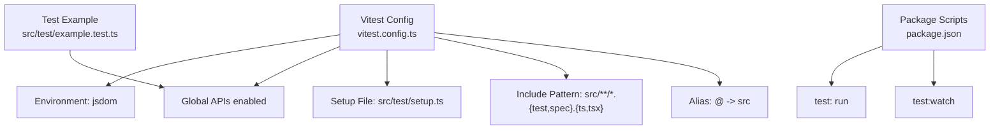
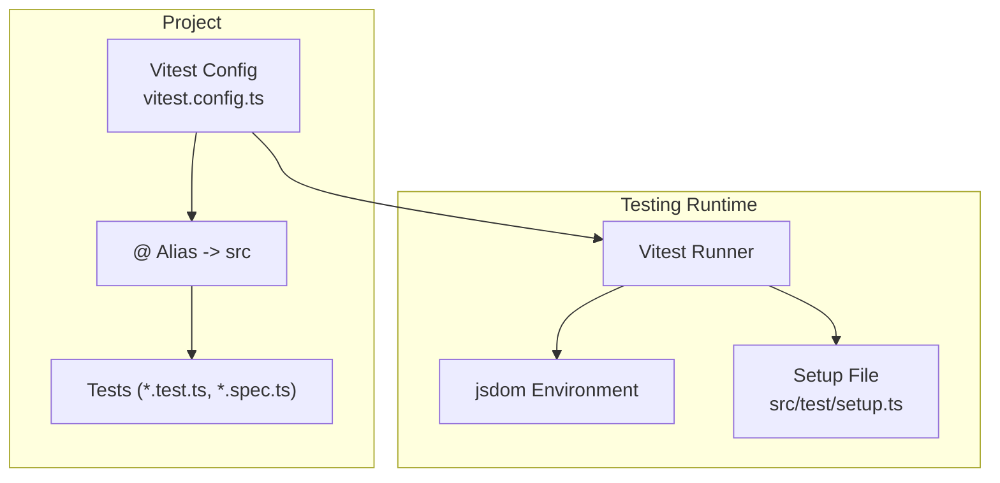
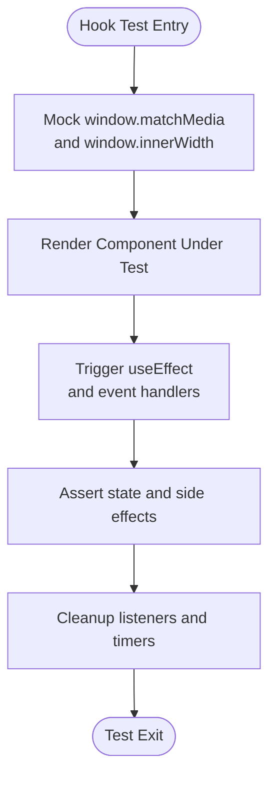
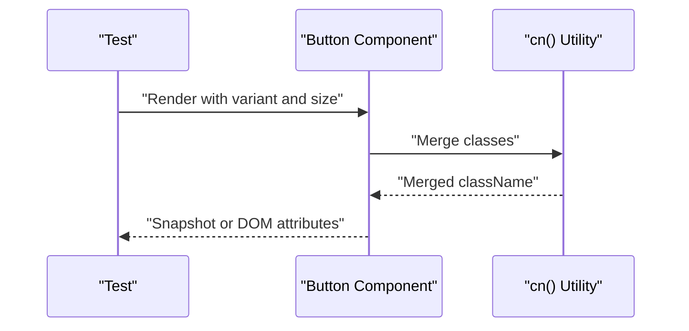
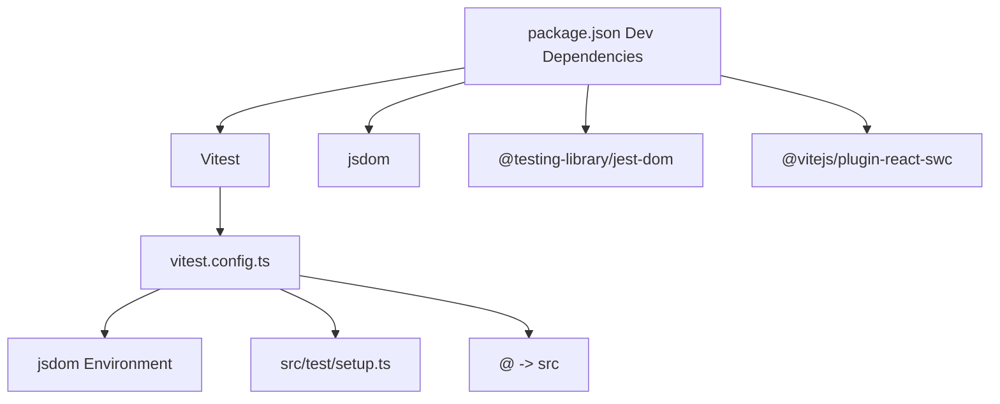

# Testing Strategy

<cite>
**Referenced Files in This Document**
- [vitest.config.ts](file://vitest.config.ts)
- [src/test/setup.ts](file://src/test/setup.ts)
- [src/test/example.test.ts](file://src/test/example.test.ts)
- [package.json](file://package.json)
- [tsconfig.app.json](file://tsconfig.app.json)
- [src/hooks/use-mobile.tsx](file://src/hooks/use-mobile.tsx)
- [src/hooks/use-toast.ts](file://src/hooks/use-toast.ts)
- [src/lib/utils.ts](file://src/lib/utils.ts)
- [src/components/ui/button.tsx](file://src/components/ui/button.tsx)
- [src/components/Navbar.tsx](file://src/components/Navbar.tsx)
- [src/lib/i18n.tsx](file://src/lib/i18n.tsx)
- [src/lib/theme.tsx](file://src/lib/theme.tsx)
</cite>

## Table of Contents
1. [Introduction](#introduction)
2. [Project Structure](#project-structure)
3. [Core Components](#core-components)
4. [Architecture Overview](#architecture-overview)
5. [Detailed Component Analysis](#detailed-component-analysis)
6. [Dependency Analysis](#dependency-analysis)
7. [Performance Considerations](#performance-considerations)
8. [Troubleshooting Guide](#troubleshooting-guide)
9. [Conclusion](#conclusion)
10. [Appendices](#appendices)

## Introduction
This document describes the testing strategy and implementation for the project. It covers Vitest configuration, testing setup, unit testing patterns, component testing approaches, mock data setup, and test coverage guidelines. It also includes examples of testing React components, hooks, and utility functions, along with best practices for snapshot testing, integration testing, test organization, naming conventions, continuous integration considerations, and troubleshooting common testing issues.

## Project Structure
The testing setup is organized around Vitest with jsdom as the DOM environment. Tests are colocated alongside source files using the pattern src/**/*.{test,spec}.{ts,tsx}. The configuration enables global test APIs and sets up a setup file for environment polyfills and matchers.

**Diagram sources**
- [vitest.config.ts](file://vitest.config.ts#L5-L16)
- [src/test/example.test.ts](file://src/test/example.test.ts#L1-L8)
- [package.json](file://package.json#L12-L13)

**Section sources**
- [vitest.config.ts](file://vitest.config.ts#L1-L17)
- [src/test/setup.ts](file://src/test/setup.ts#L1-L16)
- [src/test/example.test.ts](file://src/test/example.test.ts#L1-L8)
- [package.json](file://package.json#L6-L14)
- [tsconfig.app.json](file://tsconfig.app.json#L3-L3)

## Core Components
- Vitest configuration defines the jsdom environment, global APIs, setup file, include pattern, and module aliasing for clean imports.
- The setup file adds jest-dom matchers and a minimal polyfill for window.matchMedia to support responsive logic testing.
- The example test demonstrates the basic describe/it/expect structure.

Key configuration highlights:
- Environment: jsdom
- Globals: enabled
- Setup file: src/test/setup.ts
- Include pattern: src/**/*.{test,spec}.{ts,tsx}
- Alias: @ -> src

**Section sources**
- [vitest.config.ts](file://vitest.config.ts#L5-L16)
- [src/test/setup.ts](file://src/test/setup.ts#L1-L16)
- [src/test/example.test.ts](file://src/test/example.test.ts#L1-L8)
- [tsconfig.app.json](file://tsconfig.app.json#L3-L3)

## Architecture Overview
The testing architecture centers on Vitest with jsdom for DOM simulation, enabling component and hook tests without a real browser. Global APIs and setup ensure consistent test environments. Aliasing simplifies imports in tests.

**Diagram sources**
- [vitest.config.ts](file://vitest.config.ts#L5-L16)
- [src/test/setup.ts](file://src/test/setup.ts#L1-L16)

## Detailed Component Analysis

### Unit Testing Hooks
This section outlines patterns for testing hooks that rely on window APIs and state updates.

- useIsMobile hook
  - Purpose: Determine mobile layout based on window matchMedia and innerWidth.
  - Testing approach:
    - Mock window.matchMedia and window.innerWidth in beforeEach.
    - Trigger change events to verify state updates.
    - Verify return value after initial render and after resize.
  - Example reference: [useIsMobile hook](file://src/hooks/use-mobile.tsx#L5-L19)

- useToast hook and reducer
  - Purpose: Manage toast notifications with actions (add, update, dismiss, remove).
  - Testing approach:
    - Test reducer transitions for each action type.
    - Verify side effects like timeouts and listeners.
    - Simulate toast lifecycle (open -> close -> remove).
  - Example reference: [useToast hook](file://src/hooks/use-toast.ts#L166-L184)

**Diagram sources**
- [src/hooks/use-mobile.tsx](file://src/hooks/use-mobile.tsx#L5-L19)
- [src/hooks/use-toast.ts](file://src/hooks/use-toast.ts#L71-L122)

**Section sources**
- [src/hooks/use-mobile.tsx](file://src/hooks/use-mobile.tsx#L1-L20)
- [src/hooks/use-toast.ts](file://src/hooks/use-toast.ts#L1-L187)

### Component Testing Patterns
- Button component
  - Purpose: Renders a button with variants and sizes using class merging utilities.
  - Testing approach:
    - Test variant and size props render expected classes.
    - Test forwardRef behavior and slot composition.
  - Example reference: [Button component](file://src/components/ui/button.tsx#L39-L45)

- Navbar component
  - Purpose: Navigation with internationalization, theming, mobile drawer, and routing.
  - Testing approach:
    - Wrap with providers (I18nProvider, ThemeProvider) to supply context.
    - Mock router hooks and assets.
    - Test desktop links, language switching, theme toggle, and mobile menu.
  - Example reference: [Navbar component](file://src/components/Navbar.tsx#L13-L132)

**Diagram sources**
- [src/components/ui/button.tsx](file://src/components/ui/button.tsx#L39-L45)
- [src/lib/utils.ts](file://src/lib/utils.ts#L4-L6)

**Section sources**
- [src/components/ui/button.tsx](file://src/components/ui/button.tsx#L1-L48)
- [src/components/Navbar.tsx](file://src/components/Navbar.tsx#L1-L133)
- [src/lib/utils.ts](file://src/lib/utils.ts#L1-L7)

### Utility Functions Testing
- cn utility
  - Purpose: Merge Tailwind classes with conflict resolution.
  - Testing approach:
    - Provide multiple inputs and assert final merged class string.
    - Test precedence and deduplication behavior.
  - Example reference: [cn utility](file://src/lib/utils.ts#L4-L6)

**Section sources**
- [src/lib/utils.ts](file://src/lib/utils.ts#L1-L7)

### Provider-Based Context Testing
- I18nProvider and ThemeProvider
  - Purpose: Supply language and theme contexts to components.
  - Testing approach:
    - Wrap components under test with respective providers.
    - Mock localStorage and window.matchMedia where applicable.
    - Assert translated text and theme classes applied.
  - Example reference: [I18nProvider](file://src/lib/i18n.tsx#L148-L168), [ThemeProvider](file://src/lib/theme.tsx#L12-L31)

**Section sources**
- [src/lib/i18n.tsx](file://src/lib/i18n.tsx#L148-L168)
- [src/lib/theme.tsx](file://src/lib/theme.tsx#L12-L31)

## Dependency Analysis
Testing dependencies and their roles:
- Vitest: Test runner and assertion library.
- jsdom: DOM environment for component and hook tests.
- @testing-library/jest-dom: DOM matchers for assertions.
- @vitejs/plugin-react-swc: React plugin for Vite/Vitest.
- Path alias @: Resolves imports consistently in tests.

**Diagram sources**
- [package.json](file://package.json#L66-L87)
- [vitest.config.ts](file://vitest.config.ts#L5-L16)

**Section sources**
- [package.json](file://package.json#L66-L87)
- [vitest.config.ts](file://vitest.config.ts#L1-L17)

## Performance Considerations
- Prefer shallow rendering for leaf components and avoid unnecessary re-renders in tests.
- Use minimal setup in beforeEach and reset mocks in afterEach to reduce overhead.
- Keep tests focused on a single concern to improve speed and readability.
- Use fake timers for timeout-heavy hooks (e.g., toasts) to avoid real delays.

## Troubleshooting Guide
Common issues and resolutions:
- window.matchMedia not defined
  - Symptom: Errors when testing responsive hooks.
  - Resolution: Add polyfill in setup file as shown in the project’s setup.
  - Reference: [setup.ts](file://src/test/setup.ts#L3-L15)
- Missing DOM matchers
  - Symptom: expect().toBeInTheDocument() fails.
  - Resolution: Import jest-dom in setup file.
  - Reference: [setup.ts](file://src/test/setup.ts#L1)
- Aliasing imports in tests
  - Symptom: Module not found errors for @/* imports.
  - Resolution: Configure alias in vitest.config.ts and ensure tsconfig paths align.
  - References: [vitest.config.ts](file://vitest.config.ts#L13-L15), [tsconfig.app.json](file://tsconfig.app.json#L26-L28)
- Provider context not available
  - Symptom: useI18n or useTheme return defaults.
  - Resolution: Wrap components with I18nProvider and ThemeProvider in tests.
  - References: [i18n.tsx](file://src/lib/i18n.tsx#L148-L168), [theme.tsx](file://src/lib/theme.tsx#L12-L31)

**Section sources**
- [src/test/setup.ts](file://src/test/setup.ts#L1-L16)
- [vitest.config.ts](file://vitest.config.ts#L13-L15)
- [tsconfig.app.json](file://tsconfig.app.json#L26-L28)
- [src/lib/i18n.tsx](file://src/lib/i18n.tsx#L148-L168)
- [src/lib/theme.tsx](file://src/lib/theme.tsx#L12-L31)

## Conclusion
The project employs a pragmatic testing setup with Vitest and jsdom, complemented by jest-dom matchers and a concise setup file. Tests are colocated with source files and leverage provider wrappers for context-dependent components. Following the patterns outlined here ensures reliable, maintainable, and fast tests across components, hooks, and utilities.

## Appendices

### Test Organization and Naming Conventions
- Place tests adjacent to source files using the extension pattern: *.test.ts or *.spec.ts.
- Group related tests in describe blocks with clear titles.
- Use it for individual test cases and fit for teardown helpers.
- Keep test files small and focused on a single unit.

### Continuous Integration Considerations
- Run tests in CI using the scripts defined in package.json.
- Ensure CI environment supports jsdom and Node.js.
- Optionally configure coverage reporting and lint checks in CI.

**Section sources**
- [package.json](file://package.json#L12-L13)