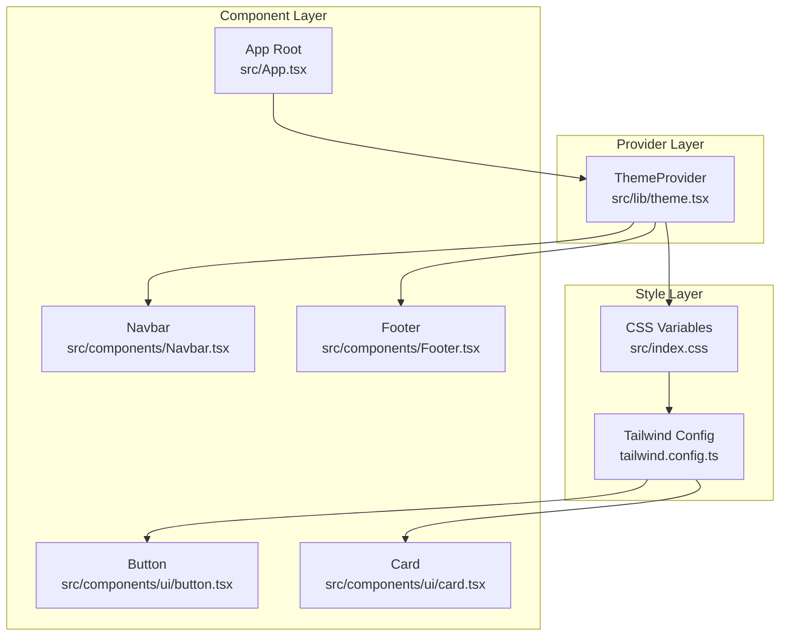
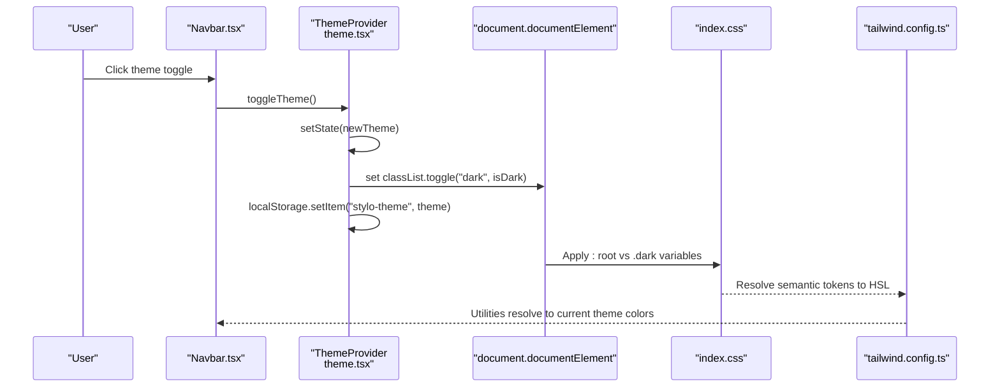
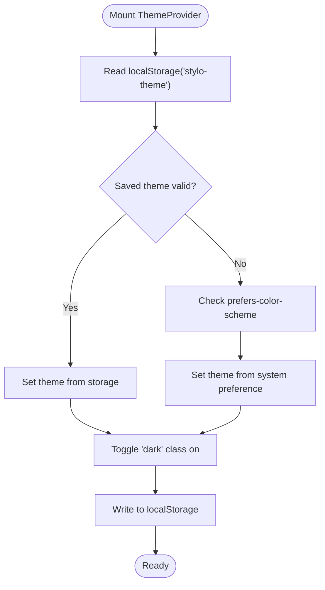
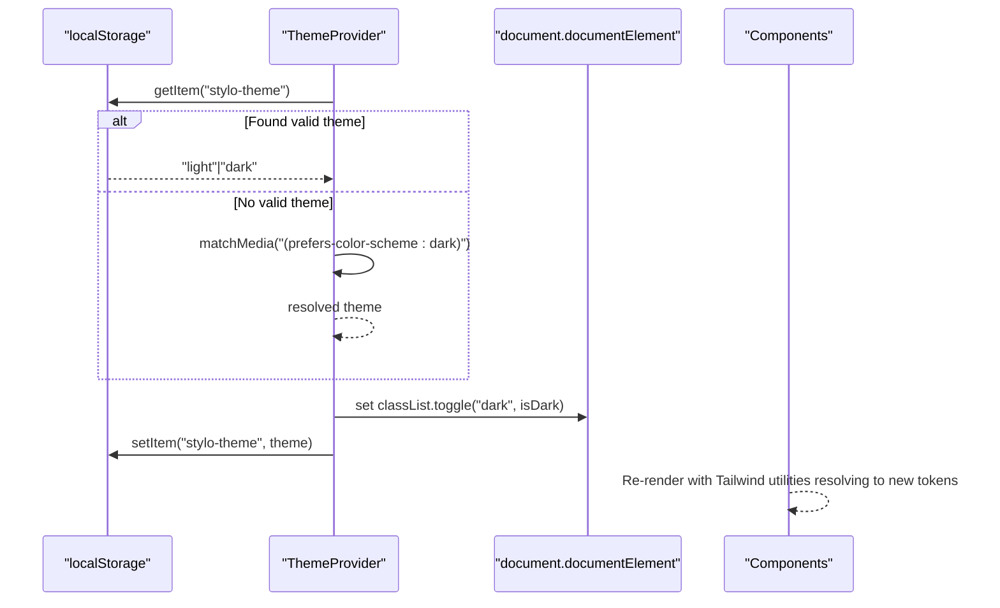
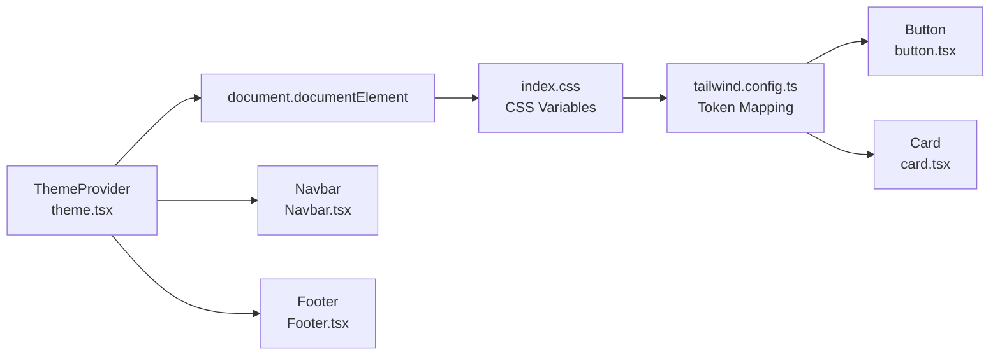

# Theming System

<cite>
**Referenced Files in This Document**
- [theme.tsx](file://src/lib/theme.tsx)
- [index.css](file://src/index.css)
- [tailwind.config.ts](file://tailwind.config.ts)
- [App.tsx](file://src/App.tsx)
- [main.tsx](file://src/main.tsx)
- [package.json](file://package.json)
- [Footer.tsx](file://src/components/Footer.tsx)
- [Navbar.tsx](file://src/components/Navbar.tsx)
- [button.tsx](file://src/components/ui/button.tsx)
- [card.tsx](file://src/components/ui/card.tsx)
- [utils.ts](file://src/lib/utils.ts)
</cite>

## Table of Contents
1. [Introduction](#introduction)
2. [Project Structure](#project-structure)
3. [Core Components](#core-components)
4. [Architecture Overview](#architecture-overview)
5. [Detailed Component Analysis](#detailed-component-analysis)
6. [Dependency Analysis](#dependency-analysis)
7. [Performance Considerations](#performance-considerations)
8. [Troubleshooting Guide](#troubleshooting-guide)
9. [Conclusion](#conclusion)
10. [Appendices](#appendices)

## Introduction
This document explains the theming system that supports light and dark modes across the application. It covers the theme provider implementation, CSS variable customization, theme persistence via localStorage, integration with Tailwind CSS, and component styling. It also documents theme switching mechanisms, system preference detection, manual overrides, responsive design considerations, accessibility compliance, performance optimization, and guidelines for extending the theme system with new color schemes.

## Project Structure
The theming system spans three layers:
- Provider layer: ThemeProvider wraps the app and manages theme state and persistence.
- Style layer: Tailwind CSS reads semantic color tokens from CSS variables and applies them based on the active theme.
- Component layer: UI components consume Tailwind utility classes that resolve to semantic tokens.

**Diagram sources**
- [theme.tsx](file://src/lib/theme.tsx#L12-L31)
- [index.css](file://src/index.css#L5-L76)
- [tailwind.config.ts](file://tailwind.config.ts#L3-L85)
- [App.tsx](file://src/App.tsx#L19-L42)
- [Navbar.tsx](file://src/components/Navbar.tsx#L13-L15)
- [Footer.tsx](file://src/components/Footer.tsx#L13-L15)
- [button.tsx](file://src/components/ui/button.tsx#L7-L31)
- [card.tsx](file://src/components/ui/card.tsx#L5-L6)

**Section sources**
- [theme.tsx](file://src/lib/theme.tsx#L1-L36)
- [index.css](file://src/index.css#L1-L146)
- [tailwind.config.ts](file://tailwind.config.ts#L1-L86)
- [App.tsx](file://src/App.tsx#L1-L45)

## Core Components
- ThemeProvider: Manages current theme, persists to localStorage, and toggles the HTML class for dark mode.
- CSS Variables: Define semantic tokens for light and dark themes, including brand-specific sidebar tokens.
- Tailwind Config: Maps Tailwind utilities to CSS variables and extends typography and animations.
- Components: Use semantic tokens (e.g., primary, background, foreground) and glass utilities.

Key behaviors:
- Initial theme resolution: localStorage value if valid, otherwise prefers-color-scheme media query.
- Persistence: Writes theme to localStorage on change.
- Dark mode activation: Adds a "dark" class to the document element.
- Component styling: Uses Tailwind utilities that resolve to CSS variables.

**Section sources**
- [theme.tsx](file://src/lib/theme.tsx#L12-L31)
- [index.css](file://src/index.css#L5-L76)
- [tailwind.config.ts](file://tailwind.config.ts#L13-L62)
- [button.tsx](file://src/components/ui/button.tsx#L7-L31)
- [card.tsx](file://src/components/ui/card.tsx#L5-L6)

## Architecture Overview
The theme system follows a unidirectional data flow:
- ThemeProvider initializes state and updates DOM attributes.
- Tailwind resolves utilities to CSS variables.
- Components render with semantic classes.

**Diagram sources**
- [Navbar.tsx](file://src/components/Navbar.tsx#L65-L72)
- [theme.tsx](file://src/lib/theme.tsx#L19-L22)
- [index.css](file://src/index.css#L5-L76)
- [tailwind.config.ts](file://tailwind.config.ts#L18-L62)

## Detailed Component Analysis

### ThemeProvider Implementation
- State initialization: Reads "stylo-theme" from localStorage; falls back to system preference.
- Side effects: Toggles "dark" class on document element and persists theme.
- Public API: Exposes theme state and toggle function via context.

**Diagram sources**
- [theme.tsx](file://src/lib/theme.tsx#L13-L22)

**Section sources**
- [theme.tsx](file://src/lib/theme.tsx#L12-L31)

### CSS Variable Customization
- Light theme variables define base palette and glass effects.
- Dark theme variables override palette and glass for contrast and readability.
- Semantic tokens include background, foreground, primary, secondary, muted, accent, destructive, border, input, ring, and sidebar tokens.
- Glass utilities leverage CSS variables for dynamic backdrop blur and shadows.

Practical customization points:
- Adjust HSL values in :root and .dark blocks to alter color families.
- Modify --radius to globally change border radii.
- Tune glass variables for different translucency and blur effects.

**Section sources**
- [index.css](file://src/index.css#L5-L76)
- [index.css](file://src/index.css#L92-L129)

### Tailwind CSS Configuration
- darkMode strategy: class-based to align with the "dark" class on <html>.
- Content paths: scans pages, components, app, and src directories.
- Extends:
  - Typography: serif/sans family tokens.
  - Colors: semantic tokens mapped to CSS variables.
  - Border radius: mapped to --radius.
  - Animations: accordion keyframes and durations.

Integration with CSS variables:
- Tailwind utilities like bg-background, text-foreground, ring-ring, etc., resolve to hsl(var(--token)) values.

**Section sources**
- [tailwind.config.ts](file://tailwind.config.ts#L3-L85)

### Component Styling and Theme Awareness
- Navbar: Uses theme-aware logo selection and theme toggle button with aria-label.
- Footer: Switches logo based on theme and applies glass utilities.
- UI primitives (Button, Card): Use semantic tokens and automatically adapt to theme.

Responsive and accessibility considerations:
- Buttons and links use hover/focus states that remain legible in both themes.
- Icons and contrast ratios are preserved via semantic tokens.

**Section sources**
- [Navbar.tsx](file://src/components/Navbar.tsx#L13-L72)
- [Footer.tsx](file://src/components/Footer.tsx#L13-L35)
- [button.tsx](file://src/components/ui/button.tsx#L7-L31)
- [card.tsx](file://src/components/ui/card.tsx#L5-L6)

### Theme Switching Mechanism
- Manual override: Clicking the toggle switches between light and dark.
- System preference detection: On initial load, uses media query to detect user preference.
- Persistence: Changes persist to localStorage and apply immediately on subsequent loads.

**Diagram sources**
- [theme.tsx](file://src/lib/theme.tsx#L13-L22)

**Section sources**
- [theme.tsx](file://src/lib/theme.tsx#L12-L31)

### Next Themes Integration Notes
- The project depends on next-themes but does not import it in the current codebase.
- The custom ThemeProvider replicates core functionality: system preference detection, localStorage persistence, and class-based dark mode.
- If integrating next-themes, replace the custom provider with its ThemeProvider and ensure darkMode is set to "class" in Tailwind config.

**Section sources**
- [package.json](file://package.json#L52-L52)
- [tailwind.config.ts](file://tailwind.config.ts#L4-L4)

### Extending the Theme System and Adding New Color Schemes
Guidelines:
- Add new semantic tokens in :root and .dark blocks in the CSS file.
- Register the new tokens in Tailwind config under theme.extend.colors.
- Use the new tokens in components via Tailwind utilities.
- Keep contrast ratios and accessibility in mind when choosing new hues.

Example extension points:
- Introduce a "tertiary" color family with DEFAULT and foreground variants.
- Add new sidebar tokens for specialized layouts.
- Extend typography families or animation sets.

Validation steps:
- Verify tokens resolve in both light and dark modes.
- Confirm component rendering remains consistent after changes.

**Section sources**
- [index.css](file://src/index.css#L18-L61)
- [tailwind.config.ts](file://tailwind.config.ts#L18-L62)

## Dependency Analysis
The theming system relies on:
- React context for theme state distribution.
- Tailwind CSS for utility-to-token mapping.
- CSS variables for theme-specific values.
- localStorage for persistence.

**Diagram sources**
- [theme.tsx](file://src/lib/theme.tsx#L19-L22)
- [index.css](file://src/index.css#L5-L76)
- [tailwind.config.ts](file://tailwind.config.ts#L18-L62)
- [button.tsx](file://src/components/ui/button.tsx#L7-L31)
- [card.tsx](file://src/components/ui/card.tsx#L5-L6)
- [Navbar.tsx](file://src/components/Navbar.tsx#L15-L15)
- [Footer.tsx](file://src/components/Footer.tsx#L15-L15)

**Section sources**
- [theme.tsx](file://src/lib/theme.tsx#L1-L36)
- [index.css](file://src/index.css#L1-L146)
- [tailwind.config.ts](file://tailwind.config.ts#L1-L86)
- [button.tsx](file://src/components/ui/button.tsx#L1-L48)
- [card.tsx](file://src/components/ui/card.tsx#L1-L44)
- [Navbar.tsx](file://src/components/Navbar.tsx#L1-L133)
- [Footer.tsx](file://src/components/Footer.tsx#L1-L103)

## Performance Considerations
- CSS variable evaluation is efficient; avoid excessive reflows by minimizing DOM writes.
- The provider toggles a single class on <html>; keep theme updates infrequent to reduce layout thrash.
- Tailwind utilities are compiled statically; ensure unused utilities are purged via content globs.
- Glass effects use backdrop-filter; test on lower-end devices and consider disabling heavy effects in reduced motion preferences.

[No sources needed since this section provides general guidance]

## Troubleshooting Guide
Common issues and resolutions:
- Theme not persisting: Verify localStorage availability and that the key matches the expected value.
- Dark mode not applying: Ensure darkMode is set to "class" and the "dark" class appears on <html>.
- Tokens not updating: Confirm CSS variables are defined in both :root and .dark blocks and Tailwind config maps them to semantic tokens.
- Accessibility contrast: Review color contrast against foreground/background in both themes.

**Section sources**
- [theme.tsx](file://src/lib/theme.tsx#L19-L22)
- [index.css](file://src/index.css#L5-L76)
- [tailwind.config.ts](file://tailwind.config.ts#L4-L4)

## Conclusion
The theming system combines a lightweight React provider, CSS variables, and Tailwind utilities to deliver a robust light/dark mode experience. It respects system preferences, persists user choices, and integrates seamlessly with UI components. By extending CSS variables and Tailwind tokens, teams can introduce new color schemes while maintaining consistency and accessibility.

[No sources needed since this section summarizes without analyzing specific files]

## Appendices

### Example Customizations
- Colors: Adjust HSL values in :root and .dark for primary/secondary palettes.
- Typography: Add or modify fontFamily entries in Tailwind config.
- Spacing: Change --radius or container paddings to refine layout rhythm.

**Section sources**
- [index.css](file://src/index.css#L5-L76)
- [tailwind.config.ts](file://tailwind.config.ts#L14-L17)
- [tailwind.config.ts](file://tailwind.config.ts#L63-L67)